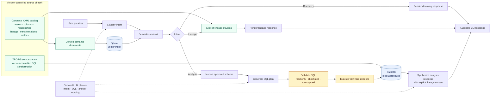

# Semantic Data Lineage Explorer

A local, CLI-first semantic data exploration prototype. It uses a version-controlled catalog and
explicit lineage as its source of truth; Qdrant provides semantic navigation over derived metadata
documents, while DuckDB remains authoritative for TPC-DS records and analytical results.

## Project scope

The project demonstrates one coherent customer-revenue path:

```text
customer + store/catalog/web sales
  → analytics.customer_revenue_yearly
  → customer yearly net-paid revenue
```

It supports semantic discovery, source-grounded lineage, and guarded SQL-backed top-customer
analysis. It intentionally does not attempt to model every proposed enterprise domain, expose a
web UI, or use distributed infrastructure.

## What this demonstrates

- Designing a typed semantic metadata model for data assets, columns, metrics, transformations,
  relationships, and explicit column-level lineage.
- Building a reproducible local analytics workflow with TPC-DS, DuckDB, version-controlled SQL,
  and catalog-to-warehouse validation.
- Using embeddings and Qdrant for metadata retrieval, including deterministic offline tests and an
  opt-in real-embedding evaluation baseline with Recall@k and MRR.
- Applying agent safety boundaries: LLMs plan intent and SQL but do not access DuckDB; generated
  SQL is parsed, schema-validated, read-only, bounded, and time-limited.
- Verifying the complete path with unit tests and a credential-free end-to-end workflow.

## Architecture



The LLM path plans intent, SQL, and optional answer wording; it never receives a database
connection. SQL is parsed, table-allowlisted, row-capped, and executed through a read-only DuckDB
connection with inspected-table and inspected-column allowlists, a bounded row limit, and a 10-second hard execution deadline. Explicit catalog lineage—not LLM inference—supplies provenance.

## Technology

Python · DuckDB · TPC-DS · Qdrant · OpenAI API · Embeddings · RAG · LangGraph · SQLGlot ·
Pydantic · Docker Compose · Pytest · Ruff

## Prerequisites

- Python 3.11–3.13
- [uv](https://docs.astral.sh/uv/)
- Docker with Docker Compose
- Network access on the first warehouse build so DuckDB can install/load its TPC-DS extension
- Optional: an OpenAI API key for real embeddings and LLM planning

## Verify from a clean clone

The offline E2E flow requires no OpenAI credentials. It creates a temporary SF 0.03 DuckDB
warehouse, indexes an isolated `semantic_catalog_e2e` Qdrant collection with deterministic test
vectors, exercises all three user paths, and evaluates retrieval.

```bash
uv sync --all-groups
docker compose up -d
uv run python scripts/run_e2e.py
```

Representative summary:

```text
qdrant_readiness       passed
warehouse_build        passed
catalog_validation     passed
metadata_indexing      passed (47 documents)
metadata_reindexing    passed (47 documents)
metadata_reconciliation passed (1 stale document removed, canonical set restored)
semantic_discovery     passed
explicit_lineage       passed
sql_backed_analysis    passed (3 expected customers)
retrieval_evaluation   passed (16 cases)
```

To preserve generated E2E artifacts and summary JSON for inspection:

```bash
uv run python scripts/run_e2e.py \
  --workspace /tmp/semantic_lineage_e2e \
  --output /tmp/semantic_lineage_e2e/summary.json
```

The E2E runner expects Qdrant to already be running; it does not start, stop, or delete Docker
services or developer collections. Run the Docker-backed pytest equivalent only when desired:

```bash
RUN_E2E=1 uv run pytest tests/integration/test_e2e_pipeline.py
```

## Environment configuration

`.env.example` is a template; the application intentionally does not load `.env` automatically.
For real OpenAI-provider commands, create `.env` and load it in your shell:

```bash
cp .env.example .env
set -a
source .env
set +a
```

`SEMANTIC_LINEAGE_EMBEDDING_API_KEY` enables OpenAI embeddings. `SEMANTIC_LINEAGE_LLM_API_KEY`
enables OpenAI intent/SQL/answer planning and falls back to the embedding key when omitted.

`--test-embedder` uses deterministic local hash vectors and an isolated test collection; it proves
integration plumbing, not semantic embedding quality. `--test-planner` uses a deterministic
revenue-path planner and does not call an LLM.

## Supported examples

Catalog indexing reconciles the named Qdrant collection with the current YAML-derived document
set: current IDs are upserted and stale IDs are deleted by explicit point ID. It never drops a
collection or affects other collections, so rerun indexing after a catalog deletion or rename.

```bash
uv run python scripts/index_metadata.py --test-embedder
uv run python scripts/search_metadata.py "where can I find customer spending" --test-embedder
uv run python scripts/explore_catalog.py --test-embedder discover "where can I find customer spending"
uv run python scripts/explore_catalog.py --test-embedder lineage customer_yearly_net_revenue
uv run python scripts/ask.py --test-embedder --test-planner "Who were the top 3 customers by net paid revenue in 2001?"
uv run python scripts/run_evaluation.py --test-embedder --output evaluation/reports/retrieval_report.json
```

### Optional real-embedding baseline

This opt-in retrieval benchmark uses OpenAI embeddings and Qdrant only; it does not call the LLM
or execute DuckDB SQL. It incurs embedding API usage. Load `SEMANTIC_LINEAGE_EMBEDDING_API_KEY`,
then index and evaluate a dedicated collection:

```bash
uv run python scripts/index_metadata.py --collection semantic_catalog_openai_baseline
uv run python scripts/run_evaluation.py --real-embedding-baseline \
  --collection semantic_catalog_openai_baseline \
  --output evaluation/reports/openai_text_embedding_3_small_baseline.json
```

The report records provider/model, vector dimensions, Qdrant version, document count, catalog and
benchmark SHA-256 hashes, timestamp, and duration. Evaluation refuses a missing, stale, or
dimension-incompatible collection. The catalog has no explicit release version, so reports identify
it as `unversioned` and use the content hash as the reproducibility identifier.

The analysis command displays the validated SQL, bounded DuckDB result, retrieved metadata IDs,
and explicit lineage context. The deterministic planner supports only this documented revenue
path. Result output is capped at 100 rows, and each query runs in an isolated process with a 10-second
hard execution deadline (override with `--query-timeout-seconds`).

## Development

```bash
uv sync --all-groups
uv run pytest
uv run ruff check .
uv run python scripts/build_warehouse.py
uv run python scripts/validate_catalog.py
docker compose up -d
uv run python scripts/run_e2e.py
```


## Repository Structure

```text
.
├── data/                 Generated local DuckDB warehouse artifacts; excluded from version control.
├── evaluation/           Version-controlled retrieval cases and locally generated evaluation reports.
├── metadata/             Canonical YAML semantic catalog for the customer-revenue path.
├── scripts/              CLI entry points for common build, validation, exploration, and evaluation tasks.
├── sql/                  Version-controlled SQL transformations used to materialize analytical tables.
├── src/
│   └── semantic_lineage/ Installable application package.
│       ├── agents/       Hosted and deterministic planner implementations.
│       ├── catalog/      Canonical metadata loading, document generation, and explicit lineage logic.
│       ├── presentation/ CLI-ready rendering of structured discovery and lineage responses.
│       ├── retrieval/    Embeddings, Qdrant persistence/reconciliation, and semantic search.
│       ├── warehouse/    DuckDB build, inspection, SQL safety, and time-bounded query execution.
│       └── workflow/     Typed LangGraph orchestration for discovery, lineage, and analysis.
└── tests/                Unit and opt-in integration/E2E regression coverage.
```

Local virtual environments, Python caches, test caches, and editor/tool configuration are omitted
from this guide because they are not part of the project's functional architecture.

### `scripts/`

CLI entry points for building, validating, indexing, exploring, evaluating, and verifying the project.
They orchestrate reusable code from `src/semantic_lineage/`; core business logic generally belongs
in `src/`, not here.

- `ask.py` — Runs one natural-language question through the LangGraph workflow. It retrieves
  catalog evidence from Qdrant, routes the question to discovery, lineage, or analysis, validates
  generated analysis SQL, executes approved DuckDB queries, and renders an auditable response.
  Supports deterministic embedding/planner flags for offline use.
- `build_warehouse.py` — Builds the local DuckDB warehouse. It generates TPC-DS data, creates
  the `analytics.customer_revenue_yearly` transformation, validates the warehouse, and writes a
  generation manifest.
- `explore_catalog.py` — Runs focused semantic catalog exploration without the full workflow. It
  supports discovery and explicit-lineage commands over documents indexed in Qdrant.
- `index_metadata.py` — Converts the canonical YAML catalog into derived semantic documents and
  indexes them in Qdrant. Re-indexing reconciles the named collection: current documents are
  upserted and stale deleted/renamed document IDs are removed.
- `run_e2e.py` — Runs the isolated, credential-free end-to-end verification flow. It builds
  temporary TPC-DS/DuckDB artifacts, indexes deterministic vectors into an isolated Qdrant
  collection, verifies discovery, lineage, analysis, reconciliation, and retrieval evaluation, and
  can write a JSON summary.
- `run_evaluation.py` — Runs the version-controlled retrieval benchmark against a Qdrant
  collection. It supports deterministic offline evaluation and an explicit opt-in real OpenAI
  embedding baseline. Reports include retrieval metrics and reproducibility metadata such as model,
  dimensions, catalog hash, and Qdrant version.
- `search_metadata.py` — Performs a direct semantic search over Qdrant-indexed catalog documents.
  Supports optional filters such as document type, domain, and asset ID.
- `validate_catalog.py` — Validates the canonical YAML catalog against the physical DuckDB
  warehouse: expected tables, columns, and documented relationships must match the warehouse.
- `validate_metadata.py` — Validates a catalog YAML file without requiring DuckDB, Qdrant, Docker,
  or API credentials. It checks the catalog schema and internal references.


### `src/semantic_lineage/`

The installable application package. It contains the reusable domain logic, integrations,
evaluation utilities, and LangGraph workflow behind the CLI scripts.

- `config.py` — Loads and validates runtime settings, including Qdrant URL, embedding
  provider/model, LLM model, and API-key environment variables.
- `models.py` — Defines strict Pydantic models for catalog assets, columns, relationships,
  transformations, lineage edges, and metrics.
- `exploration.py` — Builds deterministic discovery and explicit-lineage responses from catalog
  evidence retrieved from Qdrant.
- `evaluation.py` — Loads retrieval benchmark cases, calculates Recall@k and MRR, and creates
  provenance-rich evaluation report payloads.
- `e2e.py` — Implements the isolated credential-free end-to-end verification flow used by
  `scripts/run_e2e.py`.

- `agents/` — Defines the planning boundary for intent classification, SQL generation, and analysis
  synthesis.
  - `planner.py` — Provides typed planner outputs, the OpenAI structured-output planner with
    actionable errors, and a deterministic planner for offline tests and demonstrations.

- `catalog/` — Owns canonical YAML catalog ingestion, semantic-document derivation, and explicit
  lineage logic.
  - `documents.py` — Converts canonical catalog entities into stable, Qdrant-ready semantic documents.
  - `lineage.py` — Traverses explicit column-level lineage edges upstream or downstream.
  - `loader.py` — Parses catalog YAML into validated canonical Pydantic models.
  - `schema_validation.py` — Compares catalog table, column, and relationship references with the
    physical DuckDB warehouse.

- `presentation/` — Formats deterministic catalog-exploration results for people.
  - `responses.py` — Renders structured discovery and lineage results as CLI-ready text.

- `retrieval/` — Implements semantic metadata retrieval over derived catalog documents.
  - `embeddings.py` — Defines the embedding-provider protocol plus OpenAI and deterministic hash
    implementations.
  - `qdrant_store.py` — Creates, inspects, indexes, reconciles, and searches named Qdrant collections.
  - `search.py` — Adapts Qdrant results into stable application-facing semantic search results.

- `warehouse/` — Owns local DuckDB/TPC-DS construction and the analysis-query safety boundary.
  - `builder.py` — Generates TPC-DS data, materializes the yearly customer-revenue table, validates
    it, and writes a warehouse-generation manifest.
  - `duckdb_client.py` — Executes validated read-only SQL in a terminable worker process with a hard
    wall-clock deadline.
  - `schema.py` — Inspects catalog-approved DuckDB tables and returns schema snapshots used by
    planning and validation.
  - `sql_safety.py` — Parses and validates LLM-generated SQL against approved tables and inspected
    columns, then enforces safe statement and result-bound rules.

- `workflow/` — Contains the typed LangGraph orchestration for the application.
  - `graph.py` — Connects intent routing, retrieval, lineage, schema inspection, SQL validation,
    DuckDB execution, and answer synthesis.
